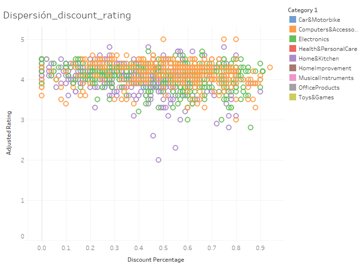
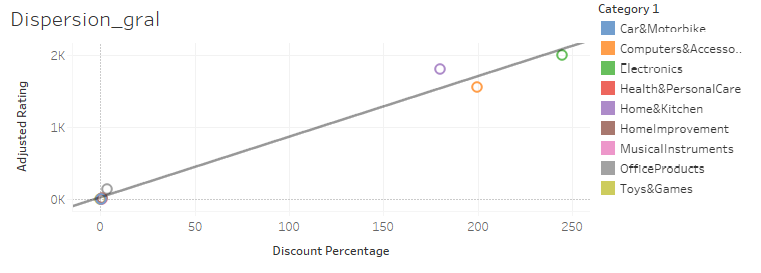
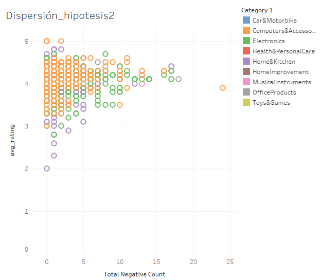

# Proyecto 4 DataLab

## Temas

- [Objetivo](#objetivo)
- [Herramientas](#herramientas)
- [Lenguajes](#lenguajes)
- [Resultados](#resultados)
- [Conclusiones y recomendaciones](#conclusiones-y-recomendaciones)
- [Recursos](#recursos)

## Objetivo
El objetivo de este análisis es entender las tendencias y patrones en las calificaciones y reseñas de productos disponibles en Amazon, con el fin de proporcionar insights que puedan ayudar a mejorar la satisfacción del cliente.

## Herramientas

## Lenguajes

## Procesamiento y preparación de datos

### Importación y Creación de Tablas en BigQuery

- ID proyecto: Proyecto4datalab.
- Tablas importadas:
    - amazon_product
    - amazon_review
### Identificación y Manejo de Valores Nulos

-  *Tabla: amazon_product*
  - about_product: 4 nulls.

 

 - *Acciones realizadas:* Se optó por eliminar estos registros dado que ya se contaba con un product_id duplicado.

 
   - *Tabla: amazon_review*
  - img_link: 466 nulls.
  - product_link: 466 nulls.
  - rating_count: 2 nulls.

- *Acciones realizadas:* 
    - Valores nulos en img_link y product_link: Se decidió mantener los valores nulos en estas columnas ya que no son variables críticas para el análisis.
    - Imputación de valores en rating_count: Se calcularon las medias de rating_count basadas en los valores de rating. Para el rating de 5, la media fue de 14, mientras que para el rating de 3, la media fue de 467. Estos valores fueron utilizados para imputar los nulos en rating_count.

### Identificación y Manejo de Valores Duplicados

-  *Tabla: amazon_product*
    - about_product: 130
    - discount_percentage: 89 
    - actual_price: 190
    - category: 136
    - product_name: 102
    - product_id: 96
    - discounted_price: 1870

En la columna product_id, se identificaron 96 valores únicos que originalmente estaban duplicados. Sin embargo, estos valores aparecen duplicados múltiples veces, resultando en un total de 214 duplicados en el dataset. Esto significa que hay 118 duplicados adicionales que no fueron contabilizados inicialmente.

-  *Tabla: amazon_review*   
    - user_id:144
    - user_name: 144
    - review_title: 144 originales (271 omitidos)
    - review_id: 144 originales (271 omitidos)
    - review_content: 141 originales (253 omitidos)
    - img_link: 49
    - product_link: 1
    - product_id: 92
    - rating: 21
    - rating_count: 204 

- *Acciones realizadas:* 
    - Eliminación de duplicados de product_id: Se filtraron los registros para excluir aquellos con about_product nulo. Luego, se eliminaron los duplicados de product_id, conservando una única instancia para cada uno. Como resultado, se obtuvieron un total de 1,351 registros únicos.
    - Variables que se mantuvieron con valores no únicos: A continuación se detallan las variables que no se consideran únicas y que pueden tener múltiples valores por product_id: about_product, discount_percentage, actual_price, category, product_name, discounted_price.

- amazon_review nulos final

 

- amazon_review duplicados final

 

- amazon_product nulos final

 

- amazon_product duplicados final

 

### Identificación y manejo de datos fuera del alcance del análisis
-  *Tabla: amazon_product*  
Se llevó a cabo una verificación de la consistencia y coherencia de los precios y descuentos registrados en la tabla amazon_product, con el objetivo de identificar y corregir posibles errores en los datos antes de realizar análisis más profundos o tomar decisiones informadas. Esta validación garantiza que los precios y descuentos reflejen con precisión la realidad del producto, preservando la integridad y confiabilidad de los datos.
Se encontraron 27 product_id, que presentan algún tipo de inconsistencia entre discounted_price, actual_price y discount_percentage
-  *Tabla: amazon_review*  

En el proceso de limpieza y transformación se comenzó pdividió la categoría de los productos en varias columnas para facilitar su análisis. También se limpió la columna que describe los productos eliminando caracteres no deseados, como emojis, paréntesis y espacios innecesarios, asegurando que el texto quedara libre de ruido.

Adicionalmente, se analizó la columna de identificadores de usuarios, contando cuántos ID estaban presentes en cada registro. Las reseñas también fueron limpiadas de signos, emojis y otros caracteres no alfabéticos, dejando solo el texto relevante para el análisis. Estas transformaciones permiten trabajar con un conjunto de datos más estructurado y limpio, adecuado para análisis posteriores y generación de insights. Concluyendo en una sola tabla que se llama datset

# Análisis de Sentimientos

Este proyecto incluye un script en Python diseñado para analizar datos de texto y extraer listas de palabras positivas y negativas a partir de las variables `review_title` y `cleaned_review_content`. Utilizando la biblioteca **TextBlob**, el script identifica y clasifica adjetivos según su polaridad de sentimiento. Puedes revisar el script [aquí](python/listado_sentimientos.py).

Una vez obtenido el listado de palabras, se realizó una consulta en **BigQuery** para generar variables dummy. Además, se llevó a cabo un conteo de palabras positivas y negativas, lo que permite un análisis más detallado de los sentimientos en las revisiones. Puedes revisar la consulta [aquí](SQL/variables_dummies_y_conteo.sql).

# Análisis de Correlaciones

El objetivo del análisis es entender las relaciones entre diferentes variables para extraer insights significativos.

## Resultados de Correlaciones
Puedes revisar la consulta [aquí](SQL/correlaciones.sql).

1. **Correlación entre `discounted_price` y `actual_price`:** **0.962**
   - **Interpretación:** Existe una correlación muy fuerte positiva entre el precio descontado y el precio real. Esto indica que a medida que aumenta el precio real, también tiende a aumentar el precio descontado, lo cual es esperado dado que el precio descontado es una reducción del precio original.

2. **Correlación entre `discounted_price` y `rating_count_clean`:** **-0.024**
   - **Interpretación:** La correlación entre el precio descontado y la cantidad de valoraciones es muy baja, casi cero. Esto sugiere que el número de valoraciones no está significativamente influenciado por el precio descontado del producto.

3. **Correlación entre `discounted_price` y `adjusted_rating`:** **-0.024**
   - **Interpretación:** La correlación entre el precio descontado y la calificación ajustada es también muy baja. Esto indica que el precio descontado no tiene un impacto significativo en la calificación media ajustada del producto.

4. **Correlación entre `discount_percentage` y `actual_price`:** **0.126**
   - **Interpretación:** La correlación entre el porcentaje de descuento y el precio real es baja. Esto sugiere que no hay una relación fuerte entre el porcentaje de descuento aplicado y el precio base del producto.

5. **Correlación entre `rating_count_clean` y `adjusted_rating`:** **0.097**
   - **Interpretación:** La correlación entre la cantidad de valoraciones y la calificación ajustada es muy baja. Esto indica que la cantidad de valoraciones no está claramente relacionada con la calificación ajustada del producto.

## Conclusión de correlaciones

- **Relación Precios:** La fuerte correlación entre el precio descontado y el precio real es esperada. Las correlaciones entre el precio descontado y otras métricas, como el número de valoraciones y la calificación ajustada, son muy bajas, indicando relaciones débiles o inexistentes.

## Validación de hipótesis 

**Hipótesis 1:** "Los productos con mayores descuentos tienden a tener calificaciones promedio más bajas debido a la percepción de menor calidad."

### Validación de la Hipótesis

La correlación global de **-0.1608** indica una relación negativa débil entre el porcentaje de descuento y el rating. Este resultado sugiere que, en general, existe una tendencia a que productos con mayores descuentos tengan calificaciones ligeramente más bajas, lo cual está en línea con la hipótesis planteada. Sin embargo, la debilidad de la correlación sugiere que otros factores también pueden estar influyendo en las calificaciones.

### Resultados Clave

- **Correlación Global:** La correlación entre el porcentaje de descuento y la calificación ajustada para todos los productos es de **-0.1608**.
  
- **Correlación por Categoría:**
  - **MusicalInstruments y HomeImprovement:** Correlación perfecta positiva (1.0). Estos resultados no apoyan la hipótesis, ya que indican que en estas categorías, mayores descuentos están asociados con calificaciones más altas.
  - **Computers&Accessories, OfficeProducts y Electronics:** Correlaciones negativas leves, que sugieren que a medida que el descuento aumenta, las calificaciones tienden a disminuir ligeramente, apoyando la hipótesis.
  - **Home&Kitchen:** Correlación positiva moderada (0.2374), lo que sugiere que un mayor descuento podría estar asociado con mejores calificaciones en esta categoría, lo cual contradice la hipótesis.
  - **Toys&Games, Car&Motorbike y Health&PersonalCare:** No se pudo calcular la correlación debido a la falta de datos.

## Conclusiones hipótesis 1 

El análisis revela que la relación entre los descuentos y las calificaciones varía considerablemente entre diferentes categorías de productos. Mientras que en algunas categorías un mayor descuento puede estar relacionado con mejores calificaciones, en otras, la relación puede ser inversa o insignificante. Aunque los resultados globales apoyan ligeramente la hipótesis planteada, los resultados segmentados por categoría indican que la relación entre descuento y calificación no es uniforme, y en algunos casos, contradice la hipótesis inicial.

**Hipótesis 2:** Un mayor número de reseñas negativas está asociado con una menor calificación promedio de los productos.

## Metodología

1. **Cálculo de Correlación**:
   - Se calcularon las correlaciones entre el número de palabras negativas y las calificaciones promedio.
   - Se utilizó el coeficiente de correlación de Spearman para evaluar la relación entre las variables ordinales.

2. **Resultados**:
   - **Coeficiente de Spearman**: -0.066
   - **Correlación entre Rating Individual y Palabras Negativas**: 0.051

## Resultados hipótesis 2

Los resultados indican una relación muy débil entre el número de reseñas negativas y las calificaciones promedio de los productos. Tanto el coeficiente de Spearman como la correlación entre las calificaciones individuales y el número de palabras negativas sugieren que no hay evidencia significativa para apoyar la hipótesis de que un mayor número de reseñas negativas se asocia con una menor calificación promedio de los productos.

