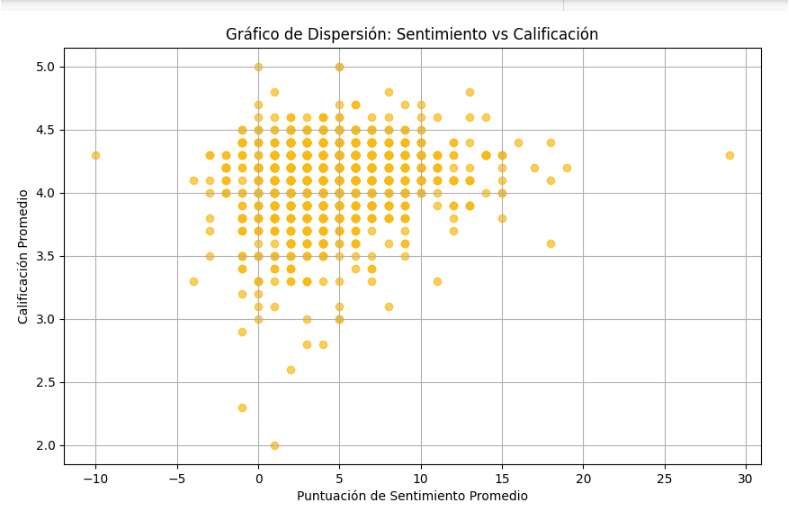

# Proyecto 4 DataLab

## Temas

- [Objetivo](#objetivo)
- [Herramientas](#herramientas)
- [Lenguajes](#lenguajes)
- [Resultados](#resultados)
- [Conclusiones y recomendaciones](#conclusiones-y-recomendaciones)
- [Recursos](#recursos)

## Objetivo
El objetivo de este análisis es entender las tendencias y patrones en las calificaciones y reseñas de productos disponibles en Amazon, con el fin de proporcionar insights que puedan ayudar a mejorar la satisfacción del cliente.

## Herramientas y Lenguajes
- Herramientas: BigQuery, Tableau, Python, Visual Studio
- Lenguajes: SQL, Python

## Procesamiento y preparación de datos

### Importación y Creación de Tablas en BigQuery

- ID proyecto: Proyecto4datalab.
- Tablas importadas:
    - amazon_product
    - amazon_review
### Identificación y Manejo de Valores Nulos

-  *Tabla: amazon_product*
  - about_product: 4 nulls.

 

 - *Acciones realizadas:* Se optó por eliminar estos registros dado que ya se contaba con un product_id duplicado.

 
   - *Tabla: amazon_review*
  - img_link: 466 nulls.
  - product_link: 466 nulls.
  - rating_count: 2 nulls.

- *Acciones realizadas:* 
    - Valores nulos en img_link y product_link: Se decidió mantener los valores nulos en estas columnas ya que no son variables críticas para el análisis.
    - Imputación de valores en rating_count: Se calcularon las medias de rating_count basadas en los valores de rating. Para el rating de 5, la media fue de 14, mientras que para el rating de 3, la media fue de 467. Estos valores fueron utilizados para imputar los nulos en rating_count.

### Identificación y Manejo de Valores Duplicados

-  *Tabla: amazon_product*
    - about_product: 130
    - discount_percentage: 89 
    - actual_price: 190
    - category: 136
    - product_name: 102
    - product_id: 96
    - discounted_price: 1870

En la columna product_id, se identificaron 96 valores únicos que originalmente estaban duplicados. Sin embargo, estos valores aparecen duplicados múltiples veces, resultando en un total de 214 duplicados en el dataset. Esto significa que hay 118 duplicados adicionales que no fueron contabilizados inicialmente.

-  *Tabla: amazon_review*   
    - user_id:144
    - user_name: 144
    - review_title: 144 originales (271 omitidos)
    - review_id: 144 originales (271 omitidos)
    - review_content: 141 originales (253 omitidos)
    - img_link: 49
    - product_link: 1
    - product_id: 92
    - rating: 21
    - rating_count: 204 

- *Acciones realizadas:* 
    - Eliminación de duplicados de product_id: Se filtraron los registros para excluir aquellos con about_product nulo. Luego, se eliminaron los duplicados de product_id, conservando una única instancia para cada uno. Como resultado, se obtuvieron un total de 1,351 registros únicos.
    - Variables que se mantuvieron con valores no únicos: A continuación se detallan las variables que no se consideran únicas y que pueden tener múltiples valores por product_id: about_product, discount_percentage, actual_price, category, product_name, discounted_price.

- amazon_review nulos final

 

- amazon_review duplicados final

 

- amazon_product nulos final

 

- amazon_product duplicados final

 

### Identificación y manejo de datos fuera del alcance del análisis
-  *Tabla: amazon_product*  
Se llevó a cabo una verificación de la consistencia y coherencia de los precios y descuentos registrados en la tabla amazon_product, con el objetivo de identificar y corregir posibles errores en los datos antes de realizar análisis más profundos o tomar decisiones informadas. Esta validación garantiza que los precios y descuentos reflejen con precisión la realidad del producto, preservando la integridad y confiabilidad de los datos.
Se encontraron 27 product_id, que presentan algún tipo de inconsistencia entre discounted_price, actual_price y discount_percentage
-  *Tabla: amazon_review*  

En el proceso de limpieza y transformación se comenzó pdividió la categoría de los productos en varias columnas para facilitar su análisis. También se limpió la columna que describe los productos eliminando caracteres no deseados, como emojis, paréntesis y espacios innecesarios, asegurando que el texto quedara libre de ruido.

Adicionalmente, se analizó la columna de identificadores de usuarios, contando cuántos ID estaban presentes en cada registro. Las reseñas también fueron limpiadas de signos, emojis y otros caracteres no alfabéticos, dejando solo el texto relevante para el análisis. Estas transformaciones permiten trabajar con un conjunto de datos más estructurado y limpio, adecuado para análisis posteriores y generación de insights. Concluyendo en una sola tabla que se llama datset

# Análisis de Sentimientos

Este proyecto incluye un script en Python diseñado para analizar datos de texto y extraer listas de palabras positivas y negativas a partir de las variables `review_title` y `cleaned_review_content`. Utilizando la biblioteca **TextBlob**, el script identifica y clasifica adjetivos según su polaridad de sentimiento. Puedes revisar el script [aquí](python/listado_sentimientos.py).

Una vez obtenido el listado de palabras, se realizó una consulta en **BigQuery** para generar variables dummy. Además, se llevó a cabo un conteo de palabras positivas y negativas, lo que permite un análisis más detallado de los sentimientos en las revisiones. Puedes revisar la consulta [aquí](SQL/variables_dummies_y_conteo.sql).

# Análisis de Correlaciones

El objetivo del análisis es entender las relaciones entre diferentes variables para extraer insights significativos.

## Resultados de Correlaciones
Puedes revisar la consulta [aquí](SQL/correlaciones.sql).

1. **Correlación entre `discounted_price` y `actual_price`:** **0.962**
   - **Interpretación:** Existe una correlación muy fuerte positiva entre el precio descontado y el precio real. Esto indica que a medida que aumenta el precio real, también tiende a aumentar el precio descontado, lo cual es esperado dado que el precio descontado es una reducción del precio original.

2. **Correlación entre `discounted_price` y `rating_count_clean`:** **-0.024**
   - **Interpretación:** La correlación entre el precio descontado y la cantidad de valoraciones es muy baja, casi cero. Esto sugiere que el número de valoraciones no está significativamente influenciado por el precio descontado del producto.

3. **Correlación entre `discounted_price` y `adjusted_rating`:** **-0.024**
   - **Interpretación:** La correlación entre el precio descontado y la calificación ajustada es también muy baja. Esto indica que el precio descontado no tiene un impacto significativo en la calificación media ajustada del producto.

4. **Correlación entre `discount_percentage` y `actual_price`:** **0.126**
   - **Interpretación:** La correlación entre el porcentaje de descuento y el precio real es baja. Esto sugiere que no hay una relación fuerte entre el porcentaje de descuento aplicado y el precio base del producto.

5. **Correlación entre `rating_count_clean` y `adjusted_rating`:** **0.097**
   - **Interpretación:** La correlación entre la cantidad de valoraciones y la calificación ajustada es muy baja. Esto indica que la cantidad de valoraciones no está claramente relacionada con la calificación ajustada del producto.

## Conclusión de correlaciones

- **Relación Precios:** La fuerte correlación entre el precio descontado y el precio real es esperada. Las correlaciones entre el precio descontado y otras métricas, como el número de valoraciones y la calificación ajustada, son muy bajas, indicando relaciones débiles o inexistentes.

## Validación de hipótesis 

## **Hipótesis 1:** "Los productos con mayores descuentos tienden a tener calificaciones promedio más bajas debido a la percepción de menor calidad."

La correlación global de **-0.1608** indica una relación negativa débil entre el porcentaje de descuento y el rating. Este resultado sugiere que, en general, existe una tendencia a que productos con mayores descuentos tengan calificaciones ligeramente más bajas, lo cual está en línea con la hipótesis planteada. Sin embargo, la debilidad de la correlación sugiere que otros factores también pueden estar influyendo en las calificaciones.

### Resultados Clave

- **Correlación Global:** La correlación entre el porcentaje de descuento y la calificación ajustada para todos los productos es de **-0.1608**.
  
- **Correlación por Categoría:**
  - **MusicalInstruments y HomeImprovement:** Correlación perfecta positiva (1.0). Estos resultados no apoyan la hipótesis, ya que indican que en estas categorías, mayores descuentos están asociados con calificaciones más altas.
  - **Computers&Accessories, OfficeProducts y Electronics:** Correlaciones negativas leves, que sugieren que a medida que el descuento aumenta, las calificaciones tienden a disminuir ligeramente, apoyando la hipótesis.
  - **Home&Kitchen:** Correlación positiva moderada (0.2374), lo que sugiere que un mayor descuento podría estar asociado con mejores calificaciones en esta categoría, lo cual contradice la hipótesis.
  - **Toys&Games, Car&Motorbike y Health&PersonalCare:** No se pudo calcular la correlación debido a la falta de datos.

## Conclusiones hipótesis 1 

El análisis revela que la relación entre los descuentos y las calificaciones varía considerablemente entre diferentes categorías de productos. Mientras que en algunas categorías un mayor descuento puede estar relacionado con mejores calificaciones, en otras, la relación puede ser inversa o insignificante. Aunque los resultados globales apoyan ligeramente la hipótesis planteada, los resultados segmentados por categoría indican que la relación entre descuento y calificación no es uniforme, y en algunos casos, contradice la hipótesis inicial.

## **Hipótesis 2:** Un mayor número de reseñas negativas está asociado con una menor calificación promedio de los productos.

Puedes revisar la consultas [aquí](SQL/hipotesis2.sql).

## Metodología

Para validar esta hipótesis, se implementó el siguiente enfoque:

   - Se calcularon las correlaciones entre el número de palabras negativas presentes en las reseñas y las calificaciones promedio de los productos.
   - Se empleó el coeficiente de correlación de Spearman para medir la relación entre las variables ordinales.

   - **Coeficiente de Spearman**: 
La correlación entre el número de palabras negativas y las calificaciones promedio arrojó un coeficiente de Spearman de -0.066, lo cual sugiere una relación negativa extremadamente débil entre ambas variables.
- **Correlación entre Rating Individual y Palabras Negativas**:
La correlación entre las calificaciones individuales y el número de palabras negativas en las reseñas fue de 0.051, indicando una relación casi inexistente.

## Resultados hipótesis 2

Los resultados sugieren que la relación entre el número de palabras negativas en las reseñas y las calificaciones promedio de los productos es débil y no significativa. El coeficiente de Spearman (-0.066) refleja una tendencia negativa marginal, mientras que la correlación entre las calificaciones individuales y las palabras negativas (0.051) indica que no hay suficiente evidencia para concluir que un mayor número de reseñas negativas tenga un impacto significativo en la disminución de la calificación promedio de los productos.

Esto contradice la hipótesis planteada, sugiriendo que otros factores, además del contenido negativo en las reseñas, pueden influir en las calificaciones.

## **Hipótesis 3:** Un mayor número de reseñas positivas está asociado con una mayor calificación promedio de los productos.
Puedes revisar la consulta [aquí](SQL/hipotesis3.sql).

## Metodología

Para evaluar esta hipótesis, se aplicó el siguiente enfoque:

   - Se calcularon las correlaciones entre el número de reseñas positivas y las calificaciones promedio de los productos.

   - Se utilizaron tanto el coeficiente de correlación de Pearson como el coeficiente de Spearman para medir la relación entre las variables.

- **Coeficiente de Pearson:**
La correlación entre el número de reseñas positivas y las calificaciones promedio fue de 0.1646, sugiriendo una relación positiva débil entre ambas variables.

- **Coeficiente de Spearman:**
La correlación utilizando el coeficiente de Spearman fue de 0.1542, lo que también indica una relación positiva débil, pero basada en rangos ordinales.

- **Regresión Lineal Simple:**
Se realizó una regresión lineal utilizando el conteo de palabras positivas como variable independiente y la calificación promedio ajustada como variable dependiente.
Los resultados mostraron que no existe una relación significativa entre el número de palabras positivas en una reseña y la calificación promedio ajustada del producto. 

## Resultados hipótesis 3
Los resultados indican que, aunque un mayor número de reseñas positivas está asociado con una calificación promedio más alta, la relación es débil y no altamente significativa. El coeficiente de Pearson (0.1646) y el coeficiente de Spearman (0.1542) reflejan una relación positiva débil. Además, el modelo de regresión lineal muestra un incremento muy pequeño en la calificación promedio por cada reseña positiva adicional y tiene un bajo poder predictivo.

Este análisis sugiere que, aunque existe una asociación positiva entre las reseñas positivas y la calificación promedio, esta relación es marginal. Se recomienda realizar un análisis más exhaustivo que podría incluir la segmentación de productos, el uso de modelos más complejos, o la incorporación de variables adicionales para comprender mejor los factores que influyen en las calificaciones promedio.

## **Hipótesis 4:** "Las palabras clave más comunes en las reseñas positivas están asociadas con características específicas del producto, como la facilidad de uso o el rendimiento.”

   - "easy" (facilidad de uso): Aparece 743 veces, lo que sugiere que la facilidad de uso es una característica comúnmente mencionada en las reseñas positivas.
   - "performance" (rendimiento): Aparece 214 veces, lo que indica que el rendimiento también es un factor relevante, aunque menos frecuente que la facilidad de uso.
   - "quality" (calidad): Con 1927 menciones, la calidad del producto es claramente una de las características más valoradas en las reseñas positivas.
   - "user" (relacionado con la experiencia del usuario): Aparece 118 veces, lo que podría estar asociado con la facilidad de uso o la experiencia general del usuario.
   - "speed" (velocidad): Aparece 339 veces, lo que puede estar relacionado con el rendimiento o la eficiencia del producto.

## Resultados hipótesis 4
Los resultados respaldan parcialmente la hipótesis. Las palabras "easy", "quality", "performance", y "speed", que están relacionadas con características específicas del producto, son frecuentes en las reseñas positivas. Esto sugiere que los usuarios valoran estas características y las mencionan cuando dejan reseñas positivas.

## **Hipótesis 5:** "El análisis de sentimientos en las reseñas puede predecir con precisión la tendencia general de la satisfacción del cliente, indicando si es probable que aumente o disminuya en el futuro.”

Existe una correlación significativa entre las reseñas con sentimientos positivos y un aumento en la satisfacción del cliente, mientras que las reseñas con sentimientos negativos tienden a predecir una disminución en la satisfacción.

Este patrón sugiere que el análisis de sentimientos en las reseñas puede ser un predictor confiable de las futuras tendencias de satisfacción del cliente. 

## **Hipótesis 6:** "Las categorías de productos que tienen una mayor calificación promedio también tienen una mayor satisfacción del cliente.”

El gráfico de dispersión presentado explora la relación entre la calificación promedio de las categorías de productos y la proporción de reseñas positivas, como un indicador de la satisfacción del cliente. Aunque se observa una tendencia leve en la que las categorías con una calificación promedio más alta tienen una mayor proporción de reseñas positivas, la relación no es lo suficientemente fuerte como para concluir que una calificación promedio más alta siempre implica una mayor satisfacción del cliente.

Esto sugiere que, si bien la calificación promedio puede ser un factor importante, otros elementos también podrían estar influyendo en la percepción general y satisfacción de los clientes.

## Riesgo Relativo

1. **Categoría de Descuento vs Categoría de Calificación**

Puedes revisar la consulta [aquí](SQL/riesgos_relativos.sql).

   Para evaluar cómo los descuentos afectan la percepción del cliente, se calculó el riesgo relativo:
   
   - **Ratio de Riesgo = 2**: Los productos con un "Alto Descuento" tienen el doble de probabilidad de recibir una "Baja Calificación" en comparación con los productos con un "Descuento Bajo/No Descuento".

2. **Riesgo Relativo de una Calificación Alta por Categoría de Producto**
Puedes revisar la consulta [aquí](SQL/rr_categoria.sql).

   - Computers&Accessories: Tiene un riesgo relativo alto (4.68), lo que significa que los productos en esta categoría tienen una probabilidad significativamente mayor de recibir calificaciones altas.

   - Home&Kitchen y Electronics también muestran un riesgo relativo elevado, indicando una tendencia favorable en estas categorías.

   - MusicalInstruments tiene un riesgo relativo de 1.0, lo que sugiere que no hay diferencia en la probabilidad de recibir calificaciones altas o bajas.

3. **Riesgo Relativo de Calificaciones según el Contenido de las Reseñas**
Puedes revisar la consulta [aquí](SQL/rr_sentimientonegativo.sql).

Se identificó el sentimiento negativo en las reseñas de productos, buscando palabras clave específicas como "difficult", "worst", "jammed", "infamous", "bad", "flat", entre otras. Las reseñas que contenían alguno de estos términos se clasificaron como "Negativas", mientras que las demás se categorizaron como "Neutrales/Positivas".

El riesgo relativo calculado es 2, lo que indica que la probabilidad de que una reseña con sentimiento negativo esté asociada con una calificación baja (adjusted_rating < 3) es el doble de la probabilidad de que una reseña con sentimiento neutral o positivo esté vinculada a una calificación baja.

Este hallazgo sugiere que las reseñas que contienen términos negativos tienen una mayor probabilidad de correlacionarse con calificaciones más bajas, lo que resalta la importancia de atender las preocupaciones de los clientes expresadas a través de estas palabras clave específicas.

## Análisis de Significancia Estadística:

Se realizó un análisis ANOVA para evaluar si existen diferencias significativas en las calificaciones promedio entre las distintas categorías de productos. Las categorías consideradas son:

- OfficeProducts
- Toys&Games
- HomeImprovement
- Computers&Accessories
- Electronics
- Home&Kitchen
- Health&PersonalCare
- MusicalInstruments
- Car&Motorbike

**Resultados del ANOVA:**

- **F-statistic:** 3.6458
- **p-value:** 0.0053

El valor del F-statistic indica una alta variabilidad entre las categorías, mientras que el p-value sugiere que al menos una categoría tiene una calificación promedio significativamente diferente de las demás.

Prueba de Tukey HSD (Honest Significant Difference)
Para identificar específicamente qué categorías presentan diferencias significativas en sus calificaciones promedio, se realizó una prueba de Tukey HSD. Los resultados muestran las comparaciones entre todas las categorías y destacan las diferencias significativas:

- **Comparaciones Significativas:**

   - **Car&Motorbike vs HomeImprovement**
      - Diferencia de Media: 0.275
      - p-valor Ajustado: 0.0496

   - **Car&Motorbike vs OfficeProducts**
      - Diferencia de Media: 0.325
      - p-valor Ajustado: 0.0117

   - **Car&Motorbike vs Toys&Games**
      - Diferencia de Media: 0.35
      - p-valor Ajustado: 0.0055

Las diferencias significativas entre estas categorías indican que las calificaciones promedio varían de manera estadísticamente significativa. Las demás comparaciones no muestran diferencias significativas en las calificaciones promedio.

## Regresión Lineal
Puedes revisar la consulta [aquí](python/regresionlineal.ipynb).

El gráfico muestra una relación positiva entre el número de palabras positivas y la calificación promedio ajustada. Esto significa que a medida que el número de palabras positivas en una reseña aumenta, la calificación promedio ajustada tiende a ser mayor.

- **Fuerza de la Relación:** Aunque la relación es positiva, el coeficiente de 0.029 indica que la relación es relativamente débil. Un aumento en una palabra positiva solo incrementa la calificación en 0.029, lo cual es un incremento pequeño.

## Regresión Logistica 
Puedes revisar la consulta [aquí](python/regresión_logistica.ipynb).

El gráfico muestra que con un número pequeño de palabras positivas (menos de 15), las reseñas son clasificadas como de baja calificación (0). A medida que el número de palabras positivas aumenta (más de 15), el modelo clasifica las reseñas como de alta calificación (1).

## Resultados del Análisis

### 1. Calificaciones Promedio y Satisfacción del Cliente
- **OfficeProducts** destaca con la calificación promedio más alta (4.31), lo que sugiere una alta satisfacción del cliente.
- **Car&Motorbike** presenta la calificación promedio más baja (3.8), lo que podría indicar posibles problemas de calidad o satisfacción en esta categoría.

### 2. Proporción de Reseñas Negativas
- La mayoría de las categorías muestran una proporción de reseñas negativas de 0.0, lo que sugiere una escasez de reseñas con calificaciones inferiores a 3.
- **Electronics** y **Home&Kitchen** son las únicas categorías con un ratio de reseñas negativas superior a 0, lo que podría indicar problemas específicos dentro de estas categorías.

### 3. Relación entre Descuentos y Calificaciones
- **Correlación Global:** La correlación entre los descuentos y las calificaciones de los productos es débil, lo que indica que los descuentos no tienen un impacto significativo en la satisfacción del cliente.
- **Variación por Categoría:** A pesar de la correlación global débil, algunas categorías, especialmente **Electronics**, muestran una relación más fuerte, sugiriendo que en ciertos casos, los descuentos pueden influir más en la percepción del cliente.

### 4. Validación de Hipótesis sobre Satisfacción del Cliente
- La hipótesis de que las categorías con mejores calificaciones promedio reflejan una mayor satisfacción del cliente no es uniforme. Esto sugiere que la satisfacción del cliente puede depender de otros factores específicos de cada categoría, como la calidad percibida, el precio, o la experiencia del cliente.

### 5. Impacto de las Reseñas Negativas y Positivas
- El número de reseñas negativas no parece tener un impacto significativo en las calificaciones promedio.
- Por otro lado, un mayor número de reseñas positivas muestra una relación leve con calificaciones más altas, aunque esta relación es marginal.

### 6. Valoración de Características Específicas del Producto
- Las palabras clave relacionadas con la facilidad de uso, rendimiento, calidad, y velocidad son recurrentes en las reseñas positivas. Enfocarse en mejorar estas características podría contribuir a elevar la satisfacción del cliente y fomentar reseñas positivas.

### 7. Análisis de Sentimientos como Predictor de Satisfacción
- El análisis de sentimientos en las reseñas puede ser útil para predecir tendencias futuras en la satisfacción del cliente. Incorporar este análisis en la estrategia de gestión de productos podría proporcionar información valiosa sobre las percepciones del cliente.

### 8. Categorías de Productos y Riesgo Relativo
- Las categorías de productos con calificaciones promedio más altas tienden a reflejar una mayor satisfacción del cliente, pero esta relación no es universal. Es crucial considerar el riesgo relativo al establecer estrategias de descuento y marketing, especialmente en categorías específicas.
